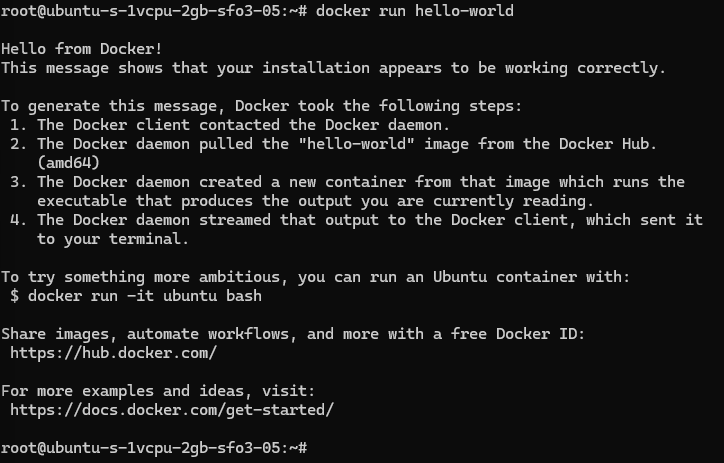

# D&D Character Sheet
> Get rid of the paper and embrace the digital.

This app creates a persistent, digital solution to maintaining and organizing Dungeons and Dragons 5E Character  sheets.

## Table of Contents
1. [Quick Start](#quick-start)
1. [VM Deployment](#vm-deployment)
1. [Current Features](#current-features)
1. [Data Model](#data-model)
1. [Next Steps](#next-steps)
1. [Credit](#credit)
## Quick Start
### Prerequisites
#### 1. Clone project
Fork and clone this project to your local machine or VM.
```bash
git clone https://github.com/{USERNAME}/DnD-Character-Sheet.git # <- Update {USERNAME}
```
#### 2. Run Docker
Ensure that Docker is running on your computer or virtual machine.
You may run the following command in Linux to check if Docker is running:
```
sudo systemctl status docker
```
#### 3. Set environmental variables
Copy .env.example into .env files and add your information in the following locations:
```
ROOT
│   .env.example 
└───character-sheet-back-end/
│   │   .env.example
```
In Linux, create copies:
```
cp .env.example .env
cp ./character-sheet-back-end/.env.example ./character-sheet-back-end/.env
```
### Launch App
To build, create, and start app services:
```
docker compose up -d --build frontend
```
To visit the app:
- In local dev environment:
```url
http://localhost
```
- When deployed:
```url
http://{Your-IP-Here}
```
### Manage Services
#### Stop
- Stop containers **without removing** them:
```
docker compose stop
```
- Stop and **remove** containers:
```
docker compose down
```
#### Get Status
- Check which containers and services are running:
```
docker compose ps
```
- View container logs:
```
docker compose logs
```

## VM Deployment
### Docker Setup
#### Update and Prepare the System
Make sure your VM is up-to-date
```bash
sudo apt update && sudo apt upgrade -y
```
Install packages that help apt use HTTPS
```bash
sudo apt install -y ca-certificates curl gnupg
```
#### Add Docker's Official GPG Key and Repository
Create the Docker directory for keyrings
```bash
sudo install -m 0755 -d /etc/apt/keyrings
```
Download and store Docker's GPG key
```bash
curl -fsSL https://download.docker.com/linux/ubuntu/gpg | sudo gpg --dearmor -o /etc/apt/keyrings/docker.gpg
```
Give the key proper permissions
```bash
sudo chmod a+r /etc/apt/keyrings/docker.gpg
```
Set up the stable repository
``` bash
echo \
  "deb [arch=$(dpkg --print-architecture) signed-by=/etc/apt/keyrings/docker.gpg] \
  https://download.docker.com/linux/ubuntu \
  $(lsb_release -cs) stable" | \
  sudo tee /etc/apt/sources.list.d/docker.list > /dev/null
```
#### Install Docker and Docker Compose
Update apt again, then install docker packages
```bash
sudo apt update
```
``` bash
sudo apt install -y docker-ce docker-ce-cli containerd.io docker-buildx-plugin docker-compose-plugin
```
Check to make sure docker is working
```bash
docker run hello-world
```
or
```bash
sudo docker run hello-world
```

#### Enable Docker to Start on Boot
Make Docker automatically start after a VM reboot
```bash
sudo systemctl enable docker
```

### Running the App using Docker
Complete the [Quick Start](#quick-start) section inside of the VM.


## Current Features
- User is able to create an account and data is stored in MySQL
- User is able to log in and homepage displays their username
- User is able to update their password from the login page
- User is able to delete their account from MySQL
- Developers are able to remotely connect to the database stored on the VM through workbench
- Bash scripts to automate the local dev setup process - Note: The portion for MySQL is not working and is commented out. 

### Resources
- Backend has API connections to third-party API's that allow access to DnD 5E character creation features - There is a limited set of features since more will be added in future sprints
- There is a rough draft of a DnD character sheet that can be integrated with the API's mentioned before - This feature is currently hard coded and will need updates


## Data Model
### Core Entities
#### Existing
-  **Users:** Manages login, sessions, and owns character sheets.

| Column Name | Type | Constraints |
| -- | -- | -- |
| id | INT | auto increment, primary key |
| email | VARCHAR(255) | unique, not null |
| username | VARCHAR(255) | unique, not null |
| first_name | VARCHAR(255) | not null |
| last_name | VARCHAR(255) | not null |
| password_hash | VARCHAR(255) | not null |
| security_hash | VARCHAR(255) | not null |

#### Planned
-  **Character Sheets:** The central object where all character data is stored and manipulated.
-  **API Data:** Fetches information about weapons, items, classes, and spells from an external D&D API.
-  **Media Query (for Printing):** Converts the character sheet's web view into a print-friendly PDF format.
### Core Functionality (CRUD)
-  **Create:** Users can create new character sheets.
-  **Read:** Users can view all saved information on their character sheet as well as short excerpts for spells, items, etc.
-  **Update:** Users can modify any information on the sheet, and the changes will be saved to the backend.
-  **Delete:** Users have the ability to delete specific items or the entire character sheet.

## Next Steps
### Customer's Vision for MVP
-  **Character Creation:** Users can create a new character.
-  **Data Persistence:** All character sheets and information are savable.
-  **View Information:** Users can easily read all inputted character information as well as details pertaining to various character aspects.
-  **Update Stats:** Users can update character stats, inventory, and other details as their character progresses.
-  **Delete:** Users can delete characters or items from a character sheet.

### Future Enhancements

-  **Dice Rolling:** An integrated digital dice roller.
-  **Status Effects:** A system for applying and tracking temporary buffs and debuffs.
-  **Random Generators:**
   -  Random Name Generator
   -  Random Character Creator
-  **Printability:** The ability to export and print a character sheet.
-  **VTT Integration:** Integration with popular virtual tabletop simulators.
-  **Sharing:** Options to share character sheets with others or make them public.
-  **User Accounts:** Full login/authentication capability.
-  **Beginner's Guide:** A step-by-step guide for users who are new to D&D character sheets, triggered by an initial prompt.
-  **Past Changes:** A modal can be opened that will show past changes.

## Credit
This App was created by students at Green River College during SDEV 372. 
- E2E Full Stack App MVP
   - Tia
   - Tav
- Dockerization
   - Augy
   - Rebecca

## Testing

### Backend Unit Tests
- Command to run backend tests in character-sheet-back-end/: npm run test
- Run coverage report: npm test -- --coverage
- Add test documentation later

### Frontend Unit Tests
